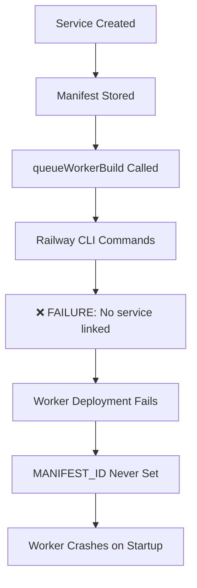

# Railway Deployment Analysis - Post CLI Fix

## Executive Summary

The Railway CLI syntax fix was successful, but revealed a deeper issue: **Railway service linking**. The CLI commands now use correct syntax but fail because no Railway service is linked in the execution context.

## Current Status

### ✅ Fixed Issues
1. **Railway CLI Syntax**: Successfully updated from `railway variables set` to `railway variables --set`
2. **Manifest Storage**: Working correctly with governance integration
3. **Service Creation**: Frontend and database operations working

### ❌ New Issue Identified
**Railway Service Linking Problem**:
```bash
❌ Deployment failed: railway variables --set "MANIFEST_ID=..." && railway up
No service linked
Run `railway service` to link a service
```

## Root Cause Analysis

### The Problem
The `queueWorkerBuild.js` function executes Railway CLI commands from the OSP project directory, but:

1. **No Service Context**: Railway CLI doesn't know which service to deploy to
2. **Missing Service Link**: Commands require either a linked service or explicit service specification
3. **Working Directory**: Commands run from OSP root, not a Railway-linked directory

### Error Chain
1. `railway variables --set "MANIFEST_ID=..."` fails → No service linked
2. Railway deployment never happens → `MANIFEST_ID` never set on Railway service
3. Worker starts but crashes → `❌ MANIFEST_ID not set. Exiting...`
4. Temporal workflow runs but no workers available

## Technical Investigation

### Railway CLI Service Specification
From Railway CLI documentation, there are multiple ways to specify services:

**Option A: Service Flag**
```bash
railway variables --set "MANIFEST_ID=value" --service <service_name>
railway up --service <service_name>
```

**Option B: Link Service First**
```bash
railway link --service <service_name>
railway variables --set "MANIFEST_ID=value"
railway up
```

**Option C: Working Directory**
```bash
cd /path/to/railway-linked-directory
railway variables --set "MANIFEST_ID=value"
railway up
```

## Current Architecture Gap

### Missing Components
1. **Railway Service Identification**: No way to specify which Railway service to deploy workers to
2. **Service Registry**: No mapping between OSP service schemas and Railway services
3. **Railway Project Configuration**: No Railway project linked in the OSP workspace

### Deployment Flow Breakdown


## Solution Options

### Option 1: Service-Specific Railway Commands ⭐ RECOMMENDED
**Approach**: Add Railway service specification to CLI commands

**Implementation**:
```javascript
// Add service parameter to queueWorkerBuild function
const railwayServiceName = `osp-worker-${service_schema}`;
const setEnvCmd = `railway variables --set "MANIFEST_ID=${manifest_id}" --service ${railwayServiceName}`;
const deployCmd = `railway up --service ${railwayServiceName}`;
```

**Pros**:
- ✅ Minimal code changes
- ✅ Explicit service targeting
- ✅ No directory dependencies

**Cons**:
- ❓ Requires Railway service naming convention
- ❓ Need to ensure Railway services exist

### Option 2: Railway Service Auto-Creation
**Approach**: Create Railway services dynamically during OSP service creation

**Implementation**:
```javascript
// 1. Create Railway service first
const createServiceCmd = `railway add --service ${service_schema}`;
// 2. Then deploy with service flag
const deployCmd = `railway up --service ${service_schema}`;
```

**Pros**:
- ✅ Fully automated
- ✅ No manual Railway setup required

**Cons**:
- ⚠️ Complex implementation
- ⚠️ Railway API integration required

### Option 3: Dedicated Worker Repository
**Approach**: Create separate Railway-linked repository for workers

**Implementation**:
- Workers deployed from dedicated repo with Railway service linked
- OSP triggers deployments via webhooks or Railway API

**Pros**:
- ✅ Clean separation of concerns
- ✅ Standard Railway deployment pattern

**Cons**:
- ⚠️ Major architectural change
- ⚠️ Repository management overhead

## Recommended Implementation Plan

### Phase 1: Quick Fix (Option 1)
1. **Update `queueWorkerBuild.js`**:
   - Add `--service` flag to Railway commands
   - Use consistent naming convention: `osp-worker-${service_schema}`

2. **Test Requirements**:
   - Verify Railway service exists or create manually
   - Test deployment with service-specific commands

### Phase 2: Railway Service Management
1. **Service Registry Enhancement**:
   - Add Railway service mapping to database
   - Track Railway service creation/status

2. **Auto-Service Creation**:
   - Implement Railway service creation during OSP service setup
   - Handle Railway project/service lifecycle

### Phase 3: Production Hardening
1. **Error Handling**:
   - Better Railway CLI error detection
   - Fallback mechanisms for failed deployments

2. **Monitoring**:
   - Railway deployment status tracking
   - Worker health monitoring

## Immediate Next Steps

### Required Information
1. **Railway Project Setup**: Is there an existing Railway project for OSP workers?
2. **Service Naming**: What naming convention should be used for Railway services?
3. **Railway Authentication**: Are Railway tokens configured for CLI access?

### Testing Strategy
1. **Manual Verification**:
   ```bash
   railway login
   railway list  # Check available projects
   railway service  # Check linked services
   ```

2. **Service Creation Test**:
   ```bash
   railway add --service test-worker
   railway variables --set "TEST=value" --service test-worker
   railway up --service test-worker
   ```

## Risk Assessment

### Risk Level: **MEDIUM**
- **Scope**: Railway CLI integration layer
- **Impact**: Worker deployment functionality
- **Complexity**: Railway service management

### Mitigation Strategies
1. **Incremental Implementation**: Start with manual service creation
2. **Fallback Options**: Manual Railway deployment if automation fails
3. **Monitoring**: Track deployment success rates

## References

- [Railway CLI Service Commands](https://docs.railway.app/reference/cli-api#service)
- [Railway CLI Up Command](https://docs.railway.app/reference/cli-api#up)
- Error logs from `a_car_restoration_service_1749437999648` deployment

## Recommendation

**PROCEED** with Option 1 (Service-Specific Railway Commands) as the immediate fix, followed by gradual implementation of Railway service lifecycle management.

---

**Analysis Date:** 2025-01-09  
**Status:** Railway Service Linking Issue Identified  
**Next Action:** Implement service-specific Railway CLI commands 