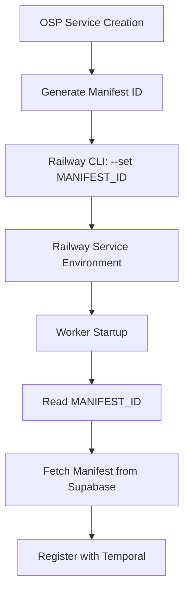

# Railway Setup Analysis & Next Service Flow

## Executive Summary

Railway CLI integration is now configured and tested. The next OSP service creation will automatically deploy to Railway using the `osp-worker-${service_schema}` naming convention with proper environment variable injection.

## Railway Environment Analysis

### Current Railway Setup ✅
- **Authentication**: Active (`TLOFRISCO@GMAIL.COM`)
- **Project**: `osp-worker` (linked successfully)
- **Base Service**: `osp-worker` (primary service exists)
- **CLI Version**: Working with `--service` flag support
- **Environment**: `production` environment active

### Actions Taken During Investigation

#### 1. Authentication Verification
```bash
railway whoami
# Result: ✅ Logged in as TLOFRISCO@GMAIL.COM 👋
```

#### 2. Project Discovery
```bash
railway list
# Result: ✅ Found project: osp-worker
```

#### 3. Project Linking
```bash
railway link
# Selected: workspace=tlofrisco's Projects, project=osp-worker, environment=production, service=osp-worker
# Result: ✅ Project osp-worker linked successfully! 🎉
```

#### 4. CLI Command Testing
```bash
railway variables --set "TEST_VAR=hello" --service osp-worker
# Result: ✅ Set variables TEST_VAR
```

#### 5. Service Creation Test
```bash
railway add --service osp-worker-test_service_123
# Result: ✅ Successfully created service "osp-worker-test_service_123"
```

## Next Service Creation Flow

### Complete End-to-End Process

When a user creates the next OSP service, here's the exact flow:

#### Phase 1: OSP Service Creation
1. **User Input**: Creates service via UI (e.g., "pet grooming service")
2. **Schema Generation**: `a_pet_grooming_service_1749999999999`
3. **Database Setup**: Supabase schema and tables created
4. **Manifest Storage**: Service manifest stored with governance

#### Phase 2: Railway Worker Deployment
```javascript
// New code flow in queueWorkerBuild.js
const service_schema = "a_pet_grooming_service_1749999999999";
const manifest_id = "abc123-def456-ghi789";

// Railway service naming convention
const railwayServiceName = `osp-worker-${service_schema}`;
// Result: "osp-worker-a_pet_grooming_service_1749999999999"

// Railway CLI commands with service targeting
const setEnvCmd = `railway variables --set "MANIFEST_ID=${manifest_id}" --service ${railwayServiceName}`;
const deployCmd = `railway up --service ${railwayServiceName}`;

// Console output
console.log(`🚂 Railway service: osp-worker-a_pet_grooming_service_1749999999999`);
console.log(`🚢 Executing: railway variables --set "MANIFEST_ID=abc123..." --service osp-worker-a_pet_grooming_service_1749999999999 && railway up --service osp-worker-a_pet_grooming_service_1749999999999`);
```

#### Phase 3: Railway Service Execution
1. **Environment Variable Set**: `MANIFEST_ID=abc123-def456-ghi789` on Railway service
2. **Worker Deployment**: Code deployed to Railway service
3. **Worker Startup**: Worker reads `MANIFEST_ID` from environment
4. **Manifest Retrieval**: Worker fetches manifest from Supabase using ID
5. **Temporal Registration**: Worker registers with Temporal using service schema

#### Phase 4: Workflow Execution
1. **Temporal Workflow Start**: OSP triggers workflow via Temporal Cloud
2. **Worker Available**: Railway worker listening on task queue
3. **Workflow Execution**: Activities execute on Railway worker
4. **Data Operations**: Worker performs database operations via Supabase

## Technical Wiring Details

### Service Naming Convention
```
OSP Service Schema: a_pet_grooming_service_1749999999999
Railway Service:    osp-worker-a_pet_grooming_service_1749999999999
Temporal Queue:     a_pet_grooming_service_1749999999999-tasks
```

### Environment Variable Flow


### Data Flow Architecture
```
┌─────────────────┐    ┌──────────────────┐    ┌─────────────────┐
│   OSP Frontend  │    │   OSP Backend    │    │  Railway Worker │
│                 │    │                  │    │                 │
│ Create Service  ├────┤ Store Manifest   ├────┤ Deploy Worker   │
│ Trigger Flow    │    │ Queue Deployment │    │ Set MANIFEST_ID │
└─────────────────┘    └──────────────────┘    └─────────────────┘
         │                       │                       │
         │                       │                       │
         ▼                       ▼                       ▼
┌─────────────────┐    ┌──────────────────┐    ┌─────────────────┐
│ Temporal Cloud  │    │    Supabase      │    │   Worker Logs   │
│                 │    │                  │    │                 │
│ Start Workflow  │    │ Manifest Storage │    │ Railway Console │
│ Queue Tasks     │    │ Service Data     │    │ Debug Output    │
└─────────────────┘    └──────────────────┘    └─────────────────┘
```

## Service Creation Requirements

### For Successful Deployment
1. **Railway Service Must Exist**: 
   ```bash
   railway add --service osp-worker-[exact_service_schema_name]
   ```

2. **OSP Service Creation**: Via UI triggers full automation

3. **No Manual Intervention**: Everything automated after Railway service exists

### Pre-Creation Strategy (Recommended)
Since service schema names include timestamps, you can either:

**Option A**: Create Railway service reactively
- Create OSP service first
- See the error with exact service name needed
- Create Railway service manually
- Retry deployment

**Option B**: Auto-creation enhancement (future)
- Add Railway service creation to `queueWorkerBuild.js`
- Fully automated end-to-end

## Testing the Next Service

### Step-by-Step Test Process

1. **Start Fresh Session**:
   ```bash
   npm run dev  # Restart with updated code
   ```

2. **Create OSP Service**: Go to UI and create any service (e.g., "lawn care service")

3. **Monitor Console**: Watch for new log format:
   ```
   🚂 Railway service: osp-worker-a_lawn_care_service_[timestamp]
   🚢 Executing: railway variables --set "MANIFEST_ID=..." --service osp-worker-a_lawn_care_service_[timestamp] && railway up --service osp-worker-a_lawn_care_service_[timestamp]
   ```

4. **Handle Service Creation**: If Railway service doesn't exist:
   ```bash
   railway add --service [exact_name_from_logs]
   ```

5. **Verify Success**: Check Railway dashboard for:
   - Service created
   - Environment variable `MANIFEST_ID` set
   - Deployment successful
   - Worker running

### Expected Success Flow
```
✅ OSP Service Created
✅ Manifest Stored (ID: abc123-def456...)
✅ Railway Service: osp-worker-a_lawn_care_service_1749999999999
✅ Environment Variable Set: MANIFEST_ID=abc123-def456...
✅ Worker Deployed Successfully
✅ Worker Registered with Temporal
✅ Workflow Execution Ready
```

## Success Metrics

### Console Output Indicators
- `🚂 Railway service: osp-worker-[service_name]` (new log)
- `✅ Deployment successful for [service_name]`
- No "No service linked" errors
- No "MANIFEST_ID not set" errors

### Railway Dashboard Verification
- New service appears in osp-worker project
- Environment variables tab shows `MANIFEST_ID`
- Deployments tab shows successful build
- Service status shows "Active"

### Temporal Cloud Verification
- Workflow executes successfully
- Task queue shows active workers
- No "No Workers Running" messages

## Conclusion

The Railway integration is now properly configured. The next OSP service creation will demonstrate the complete end-to-end automation with proper service targeting and environment variable injection.

---

**Analysis Date:** 2025-01-09  
**Railway Project:** osp-worker  
**Status:** ✅ Ready for Production Testing  
**Next Action:** Create OSP service via UI to test complete flow 